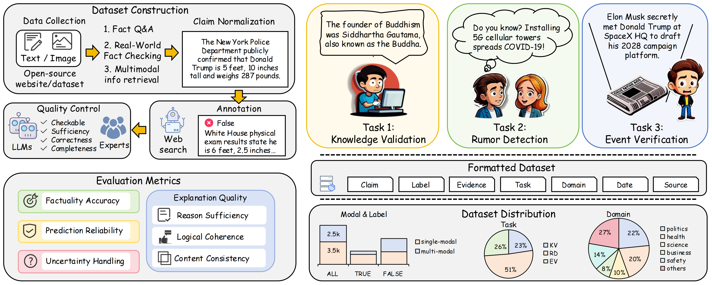

# RealFactBench

[](https://arxiv.org/abs/2406.11288)

<p align="center"> 

</p>

We introduce RealFactBench, a comprehensive benchmark designed to assess the fact-checking capabilities of LLMs and MLLMs across diverse real-world tasks, including
Knowledge Validation, Rumor Detection, and Event Verification. RealFactBench consists of 6K high-quality claims drawn from authoritative sources, encompassing multimodal content and diverse domains. The dataset could be found at [DATASET](https://huggingface.co/datasets/kalends/RealFactBench)

## Citation
If you find our paper useful for your research, please consider giving a star :star: and citation :pencil: :)

```BibTeX
@misc{yang2025realfactbench,
    title={RealFactBench: A Benchmark for Evaluating Large Language Models in Real-World Fact-Checking},
    author={Shuo Yang and Yuqin Dai and Guoqing Wang and Xinran Zheng and Jinfeng Xu and Jinze Li and Zhenzhe Ying and Weiqiang Wang and Edith C. H. Ngai},
    year={2025},
    eprint={2506.12538},
    archivePrefix={arXiv},
    primaryClass={cs.CL}
}
```
